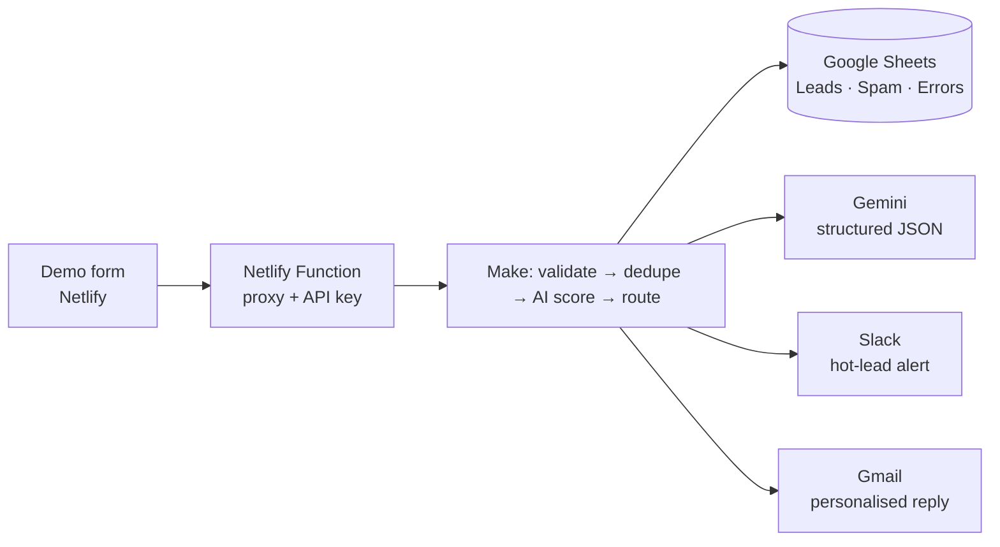

# LeadFlow: AI lead qualification and routing on Make.com

**Built by Media & Software Manager** · Make.com · Google Gemini · Google Sheets · Slack · Gmail · Netlify

> **About the data.** LeadFlow runs on a **demo** form. Every lead shown here and in the video is **synthetic test data**, and every number below was **measured** during the build (4–5 October 2026). No customer outcomes are claimed.

**Demo video:** [demo-video.mp4](demo-video.mp4)  ·  **Live demo form:** https://m-and-s-leadflow-demo.netlify.app/

---

## The problem

Small service businesses usually receive enquiries through a website form that lands in a shared inbox:
- Replies wait until someone checks the inbox.
- Every enquiry is triaged by hand.
- High-value requests sit in the same queue as spam.

Research on online lead response (Oldroyd, McElheran & Elkington, *Harvard Business Review*, 2011) found that companies which contact web leads quickly are far more likely to qualify them.

**Goal:** acknowledge every genuine enquiry within seconds, score it with AI, alert the owner about hot leads immediately, keep spam out, and do it all on **free tiers**.

## What I built

A Make.com scenario of about 30 modules behind a Netlify-hosted form:

1. **Secure intake.**
   - The form posts to a Netlify Function that adds Make's webhook API key server-side, so no secret ever reaches the browser.
   - Make rejects wrong keys before the scenario starts, at **0 credits**.
   - Bots (honeypot and timing trap) are dropped at the proxy, also at **0 credits**.
2. **Validation and dedupe.**
   - One router validates the payload with 15 conditions.
   - Google Sheets is searched by email. Returning leads update a counter instead of creating duplicates.
   - Replays of the same submission are ignored.
3. **AI scoring.**
   - Gemini is called through Make's raw HTTP module with a strict JSON response schema and a versioned prompt.
   - It returns a score (0–100), tier, intent, budget signal, a summary, a next action and a personalised opener.
   - Lead text is treated as untrusted. Prompt-injection attempts are flagged and penalised.
4. **Rules safety net.** A deterministic rules score runs alongside the AI:
   - It pre-screens obvious link spam, so those leads don't spend AI credits.
   - It takes over if Gemini fails.
   - It guards against the AI wrongly marking a good lead as spam.
5. **Routing.**
   - **Hot:** Leads row, Slack alert (with a phone push) and a personalised email.
   - **Warm:** Leads row and a standard email.
   - **Cold:** Leads row only.
   - **Spam:** quarantine tab.
6. **Error handling.**
   - Every module that can fail has a handler.
   - A Google Sheets failure alerts the owner in Slack, with the lead's details.
   - Slack and Gmail failures are logged to an Errors tab.
   - Lead text is escaped before it reaches email (verified with an HTML-tag test name) and Slack, so it can't inject HTML or ping a channel.

## Measured results (synthetic data)

| What | Result |
|---|---|
| Form reply time | **0.9–1.5 s** (Make replies before the AI step finishes; one 2.5 s outlier) |
| Owner sees a hot lead | **seconds** after submit (Slack alert in the same run) |
| Make credits per lead | **hot 12 · warm 11 · cold 10 · AI spam 10 · link spam 6 · duplicate 5 · replay 4 · invalid 3 · bot 2 (0 via proxy) · wrong key 0** |
| Monthly capacity on Make Free (1,000 credits) | ~100 leads of a realistic mix |
| AI scoring (8 synthetic cases, Gemini Flash-Lite) | **8/8 correct tiers**: hot 87, warm 58–62, cold 12–14, vendor pitch → spam, injection attempt → flagged and cold |
| AI outage (deliberately broken model) | Lead still **captured, rules-scored and routed hot**, with alert and email; the row records `rules_fallback` and `http_404` |
| Free-tier AI availability | Flash: 6 of 14 calls returned 503 "busy". **Flash-Lite: 12/12 succeeded**, faster |
| Running cost | **£0**: Make Free, Gemini free tier, Google Sheets, Slack Free, Gmail, Netlify Free |

## Engineering notes: what the docs didn't tell me

Every platform assumption is logged with its source, or the test that proved it, in [DECISIONS.md](DECISIONS.md) (56 entries). The most useful lessons:

- **Gemini's new structured-output field was rejected by the live API** (HTTP 400). The older `responseMimeType` + `responseSchema` worked, and a zero-credit local smoke test caught this before it reached Make (#26).
- **Google Sheets "Search Rows" returns one *empty* bundle when nothing matches,** so a `length() > 0` check treats new leads as existing ones. The dedupe now routes on whether a row number exists (#11).
- **Search Rows outputs columns under numeric keys** (`"3"`, `"4"`), not header names, so formulas using header names silently returned nothing (#51).
- **Mapped values inside quoted text in Make formulas are not substituted** (#52).
- **Make answers the webhook before the run finishes,** so the form stays fast even with AI in the loop (#50).
- **Make's webhook API key** turned an unauthorised request from 2 credits into 0, and keeps the secret out of exported blueprints (ADR-008).
- **New Netlify projects are private by default**, and **Gmail connections need every Google permission box ticked**. Both are now in the build checklist (#49, #55).

## Known limitations (honest scope)

- **Demo form only, with synthetic data.** Real enquiries would need Gemini's paid tier (the free tier may use content to improve Google products) and a privacy notice.
- **No automatic retry on Google Sheets failures.** The owner alert carries the lead's details for manual entry (#7).
- **Rare duplicates are possible** under concurrent submissions (sequential processing is off, so one Sheets outage can't freeze intake).
- **Slack's free plan** shows 90 days of history; Google Sheets is the system of record.

## Documentation

- [PRD.md](PRD.md): requirements and acceptance tests
- [ARCHITECTURE.md](ARCHITECTURE.md): module-by-module build spec, data contracts, credit budget, ADRs
- [DECISIONS.md](DECISIONS.md): every platform fact with its official source or test result
- Screenshots *(synthetic data)*: [Make scenario](screenshots/make-scenario.png) · [Slack hot-lead alerts](screenshots/slack-hot-alerts.png) · [landing page](screenshots/landing-page-dark.png)
- The scenario was built in Make with help from Maia, Make's AI assistant, from the module-by-module spec in ARCHITECTURE.md
